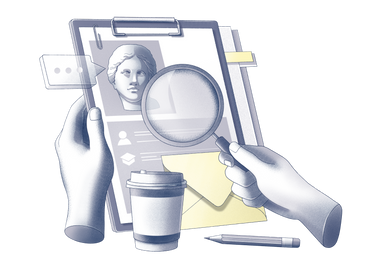

<div align="center">
  
</div>

<div align="center">
  <h3> <a href="https://github.com/Solrikk/Echo-Image/blob/main/README.md"> English | <a href="https://github.com/Solrikk/Echo-Image/blob/main/README_RU.md">Русский</a> | <a href="https://github.com/Solrikk/Echo-Image/blob/main/README_GE.md"> Deutsch </a> | <a href="https://github.com/Solrikk/Echo-Image/blob/main/README_JP.md"> 日本語 </a> | <a href="README_KR.md">한국어</a> | <a href="README_CN.md">中文</a> </h3>
</div>

-----------------

# Echo-Image ⚡️

 **_EchoImage:_** is an advanced platform designed for the precise discovery of similar images. Utilizing structural similarity and keypoint matching algorithms, EchoImage provides a swift and accurate method for image comparison. The application supports uploading images directly or via URLs, efficiently navigating through a vast image database to identify the best matches. Thanks to its use of asynchronous technology, EchoImage ensures rapid processing, offering a seamless and effective visual search experience.

**_You can create a database from here_** - ([details](https://github.com/Solrikk/ImageSpaceDB))

## Features
- **_Supports Multiple-Technologies_** ☄️

    _**Python**_  with libraries:
  - `FastAPI` for the web framework.
  - `aiohttp` for asynchronous HTTP requests.
  - `cv2` (OpenCV) for image processing.
  - `numpy` for numerical operations.
  - `skimage` for additional image processing techniques.

- **_Supports Multiple-Indexes_** 🚀

  - `Structural Similarity Index (SSIM)` ([details](https://en.wikipedia.org/wiki/Structural_similarity_index_measure))
  - `Feature Matching with ORB (Oriented FAST and Rotated BRIEF) Descriptor` ([details](https://en.wikipedia.org/wiki/Oriented_FAST_and_rotated_BRIEF))
  - `Resizing and Grayscale Conversion` ([details](https://en.wikipedia.org/wiki/Grayscale))
  - `Hashing for Image Identification`
    
# Examples
`Python example` [[more info](https://github.com/Solrikk/EchoImage/blob/main/main.py)]

```Python
async def process_image(session, image_entry, target_image):
  try:
    # Asynchronously download the image from the given URL.
    current_image = await download_image(session, image_entry["url"])
    # Determine the larger dimensions between the target and current images, but cap it at 1024 pixels.
    optimal_size = max(max(target_image.shape[:2]), 
                       max(current_image.shape[:2]))
    optimal_size = min(1024, optimal_size)
    # Resize both images to the calculated optimal size for uniform comparison.
    target_image_resized = cv2.resize(target_image, 
                                      (optimal_size, optimal_size))
    current_image_resized = cv2.resize(current_image, 
                                       (optimal_size, optimal_size))
    # Convert both images to grayscale to simplify further calculations.
    target_gray = cv2.cvtColor(target_image_resized, cv2.COLOR_BGR2GRAY)
    current_gray = cv2.cvtColor(current_image_resized, cv2.COLOR_BGR2GRAY)
    # Calculate the SSIM (Structural Similarity Index) between the two grayscale images.
    ssim_index = ssim(target_gray, current_gray)
    # Initialize ORB detector to find keypoints and descriptors.
    orb = cv2.ORB_create(nfeatures=500)
    # Detect keypoints and compute descriptors for both images.
    target_keypoints, target_descriptors = orb.detectAndCompute(target_gray, None)
    current_keypoints, current_descriptors = orb.detectAndCompute(current_gray, None)
    # If there are no descriptors found, return a similarity score of 0.
    if target_descriptors is None or current_descriptors is None:
      return (0, image_entry["url"])
    # Parameters for the FLANN matcher to find the best matches between descriptors.
    index_params = dict(algorithm=6,
                        table_number=6,
                        key_size=12,
                        multi_probe_level=1)
    search_params = dict(checks=50)  # The number of checks to perform for matching
    # Initialize the FLANN matcher with the specified parameters.
    flann = cv2.FlannBasedMatcher(index_params, search_params)
```

#


SSIM compares patterns of pixel intensity changes which are important attributes for human vision. The SSIM score ranges from `-1 to +1`, where a `value of 1` indicates identical images. The process can be broken down into three components:

 

1) **_Luminance Comparison_** allows for the assessment of the overall luminance of the images. Luminance in SSIM is measured as the average of all pixel values.

```Python
target_gray = cv2.cvtColor(target_image_resized, cv2.COLOR_BGR2GRAY)
current_gray = cv2.cvtColor(current_image_resized, cv2.COLOR_BGR2GRAY)
ssim_index = ssim(target_gray, current_gray)
```

2) **_Contrast Comparison_** is measured through the variance of pixel intensities (variations from the average value), understanding how similar the patterns of light and shadow distribution are between two images.
3) **_Structure Comparison_** compares patterns of spatial pixel distribution, ignoring variations in luminance and contrast. It is done by calculating the covariance between the images relative to their local average values.


To compare images, the Structural Similarity Index **(SSIM)** is used to assess the similarity between images, as well as the **ORB (Oriented FAST and Rotated BRIEF)** algorithm for detecting key points and their descriptions.

## _ORB (Oriented FAST and Rotated BRIEF)_ 
ORB method used in computer vision, particularly popular for tasks related to object recognition, image matching, and tracking. This method is focused on quickly finding key points on images and describing them in a way that allows for efficient comparison. Let's break down what ORB does with simpler examples:

 

1) **Oriented FAST (Features from Accelerated Segment Test):** This part is responsible for detecting points of interest (or key points) on the image. It quickly identifies corners or edges that stand out in comparison to their surrounding areas. This way, significant or unique sections of the image can be identified.

2) **Rotated BRIEF (Binary Robust Independent Elementary Features):** After key points have been found, it's necessary to create a description of each to allow comparison with key points from another image. BRIEF generates a brief binary description of the points but lacks resistance to image rotation. This is where the "rotated" part comes in - ORB adds the ability to stably describe points even when images are rotated.

By combining these two approaches, ORB provides a fast and efficient way of matching images despite changes in viewing angle, scale, or lighting.

_Using the ORB algorithm, key points and descriptors are determined for both the current and target images._

The found key points are compared with each other to determine matches. These matches allow assessing the similarity of images from a perspective other than SSIM. The final similarity score is calculated as the average between the SSIM score and the relative number of matching key points (using the ORB algorithm), providing a comprehensive approach to analyzing the similarity of images.

EchoImage application, both the SSIM and ORB methods are utilized to find images that are similar to an uploaded image. Here's a simplified explanation of how each method works in the context of your application and contributes to finding similar images:

## How SSIM Works in EchoImage:
1) **_Resizing Images:_** When comparing the uploaded image to each image in the database, both images are resized to the same dimensions `(256x256 pixels)`. This standardizes the comparison, making it fair and more efficient since we're working with images of the same size.

2) **_Converting to Grayscale:_** Both images are converted to grayscale. This simplifies the comparison by focusing on the structure and intensity of light rather than being distracted by color differences.

3) **_Structural Similarity Comparison:_** The SSIM method then compares these grayscale images to assess their structural similarity. This involves analyzing how similar the patterns of light and shadow are between the two images, giving a score that reflects their similarity. A high score means the images are structurally similar.

## How ORB Works in EchoImage:
1) **_Detecting Key Points:_** ORB first identifies key points in both the uploaded image and each database image. These key points are distinctive spots that can be easily recognized and compared between images, such as corners and interesting textures.

2) **_Describing Key Points:_** For each key point detected, ORB generates a unique descriptor that summarizes the key point's characteristics. This descriptor is made rotation-invariant, meaning it describes the key point in a way that's consistent even if the image is rotated.

3) **_Matching Key Points:_** The application then matches key points between the uploaded image and each database image using these descriptors. The matching process involves finding key points in the database image that have descriptors similar to those in the uploaded image.

4) **_Scoring Matches:_** The more key points that match between two images, the higher the score of similarity based on ORB. This score reflects how many distinctive features are shared between the images.

## Combining SSIM and ORB:
After calculating similarity scores using both SSIM and ORB for each image comparison, Harmony-Image averages these scores to get a final measure of similarity.
Images from the database are then ranked based on their final similarity scores, and the top 5 most similar images are selected.

## Final Selection of Similar Images:
The application filters out duplicate URLs to ensure a diverse set of similar images.
 It returns URLs of the top similar images, which can then be presented to the user.
 In essence, your application uses a combination of structural analysis (SSIM) and feature matching (ORB) to find and rank images in your database that are most similar to an image uploaded by the user. This dual approach leverages the strengths of both methods, ensuring a robust and nuanced comparison that goes beyond simple pixel-by-pixel analysis.
